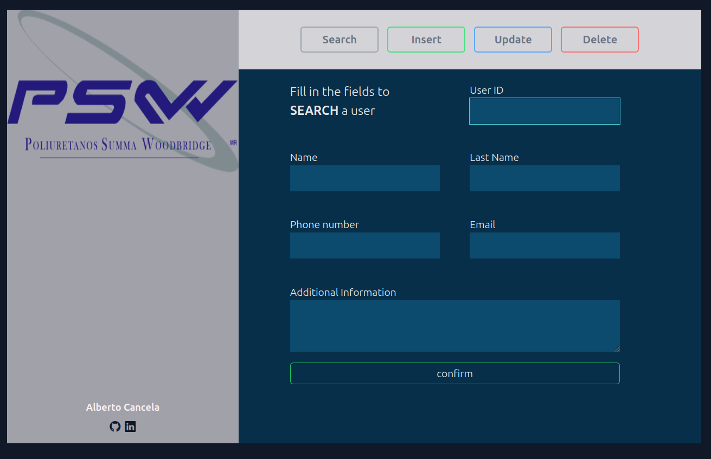
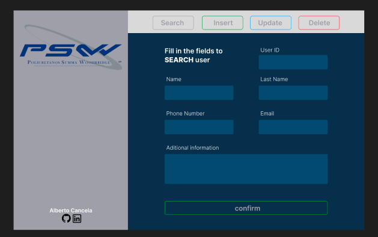
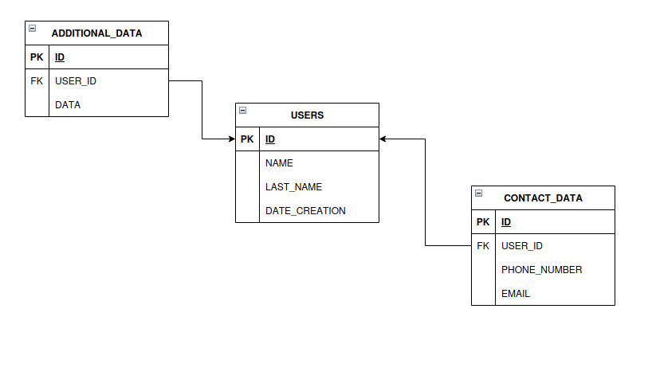

# Hola!

## Introducción
Hola, primero que todo, debo una disculpa por la tardanza. El trabajo y la vida diaria me dejaron unas cuantas horas para realizar el cuestionario y todo lo que conlleva, pero aquí está.

Este repositorio se ha hecho principalmente para no entregar un proyecto en el cual sólo sea código sin más, si no un proyecto completamente ejecutable por pequeño que sea y con la facilidad que github nos da para compartirlo. 
Aunado a ello, cabe recalcar que a pesar de haber usado las mejores prácticas en la medida de lo posible, también fue hecho para un desplante de código, por lo que es funcional pero completamente refactorizable para su mejora en rendimiento y menos redundancia. ¡Muchas gracias!

## ¿Cómo iniciar el proyecto?
Este es el enlace para poder clonar el repo 
```
git clone https://github.com/AlbertoCancela/basic-crud.git
```

Una vez descargado, si se usa un entorno linux, se tiene la oportunidad de ejecutar directamente la aplicación desde el archivo exec.sh
```
./exec.sh    
```
> [!IMPORTANT]
> Sólo funciona si se usa una distro basada en Debian, Redhat o Arch.
> También cabe recalcar que el sh descarga php si no se tiene instalado, y si usas windows, sólo basta
> con iniciar en localhost el servidor php y correr la aplicación en index con el mismo sistema php o xampp/wampp.

## Explicación del sistema
Es un sistema simple hecho con html, js, php y tailwind para los estilos, además de librerías como bootstrap (para dos íconos) y sweet alert para las alertas, además de una base de datos funcional desde cualquier parte.

> [!NOTE]
> Inicialicé una base de datos de prueba en el servidor de la universidad donde trabajo (por ello funciona), pero tanto esta como el usuario
> gestor de la bdd tienen los permisos limitados a lo que un CRUD necesita.

Decidí hacer un formulario simple de ingreso de datos, pudiendo seleccionar si hacer una búsqueda, una inserción de datos, actualización y borrado de usuarios desde el mismo formulario, adaptado para que no tener que moverse de un lugar a otro.

    
## ¿Cómo funciona?


### SEARCH
Cuando se inicia el formulario, la primera opción es search, por lo que el único campo habilitado es el de ID,
trayendo consigo una vez confirmado el ID, todos los datos correspondientes de los campos en pantalla.
Cuando se selecciona esta opción, sólo el campo ID está habilitado y los demás no, aunado a ello, se limpian dichas celdas inhabilitadas.
### INSERT
Seleccionada esta opción, el campo ID se deshabilita y se limpia, habilitando los campos restantes y siendo estos los que serán ocupados para la inserción una vez confirmados y <b>verificados</b> los datos.

> [!NOTE]
> Recomiendo empezar un flujo de trabajo con INSERT para tener un usuario con el que hacer pruebas.
> Las validaciones para todos los campos habilitados son que no pueden estar vacíos.
> El campo UserID y additionalData no tiene límite de caracteres, pero los demás sí (15).
> UserID, phoneNumber e email son evaluados por expresiones regulares para comprobar si son números o tienen un formato de mail válido respectivamente.

Al confirmar y todo salga correctamente, se devuelve un mensaje de success y el ID del nuevo usuario.

### UPDATE
Al seleccionar update, podremos rellenar todos los campos disponibles para editarlos en las tablas de la BDD correspondientes.
> [!TIP]
> Al estar userID deshabilitado al presionar update, un flujo de trabajo ideal para este es primero hacer una búsqueda en search y luego presionar UPDATE para traer el ID y los datos actuales en los campos, para luego sobreescribir estos.

### DELETE
Al presionar delete, podemos eliminar el registro que contenga el ID del campo UserID. 
> [!TIP]
> Al igual que con UPDATE, se recomienda primero usar search y luego delete para visualizar exactamente qué se eliminará.


Y una vez hecho eso... ¡se ha terminado con el despliegue de las funcionalidades del programa! si gustan, pueden revisar el linkedin y mi perfil en github en los íconos correspondientes. Muchas gracias. 

<hr>

## PREGUNTAS  21 - 25

### 21.- CRUD USUARIOS, DIAGRAMAS Y BDD
Al haber sido este repo un CRUD en sí mismo, dejo a continuación los enlaces e imágenes de mi diseño en figma (antes de comenzar a programar) y mis diagramas entidad-relación básicos de las tablas y su respectivo DDL en SQL.


```
https://www.figma.com/design/tkMPBi3bVPdmFimxvcaqCh/PSW-CRUD-usuarios?node-id=0-1&p=f&t=b3m2CSu27gprgtYU-0   
```


DDL
```
    CREATE TABLE USERS (
        ID INT NOT NULL AUTO_INCREMENT PRIMARY KEY,
        NAME VARCHAR(100) NOT NULL,
        LAST_NAME VARCHAR(100) NOT NULL,
        DATE_CREATION TIMESTAMP DEFAULT CURRENT_TIMESTAMP
    );
    CREATE TABLE CONTACT_DATA (
        ID INT NOT NULL AUTO_INCREMENT PRIMARY KEY,
        USER_ID INT NOT NULL,
        PHONE_NUMBER VARCHAR(20),
        EMAIL VARCHAR(150),
        CONSTRAINT FK_CONTACT_USER FOREIGN KEY (USER_ID) REFERENCES USERS(ID) ON DELETE CASCADE
    );
    CREATE TABLE ADDITIONAL_DATA (
        ID INT NOT NULL AUTO_INCREMENT PRIMARY KEY,
        USER_ID INT NOT NULL,
        USER_DATA VARCHAR(100),
        CONSTRAINT FK_ADDITIONAL_USER FOREIGN KEY (USER_ID) REFERENCES USERS(ID) ON DELETE CASCADE
    );
```
### 22 y 23.- VISTAS, TRIGGERS, SP && EJEMPLO con CRUD realizado
| Concepto             | Definición                                                              | Ejemplo                                  |
|----------------------|------------------------------------------------------------------------|------------------------------------------|
| **Vistas (`VIEW`)**  | Tabla virtual que simplifica consultas complejas                     | ```sql  CREATE VIEW UserFullInfo AS  SELECT   u.ID AS UserID,   u.NAME AS Name,   u.LAST_NAME AS LastName,   u.DATE_CREATION AS CreatedAt,   c.PHONE_NUMBER AS PhoneNumber,   c.EMAIL AS Email,   a.USER_DATA AS AdditionalData FROM USERS u LEFT JOIN CONTACT_DATA c ON u.ID = c.USER_ID LEFT JOIN ADDITIONAL_DATA a ON u.ID = a.USER_ID; ``` |
| **Triggers (`TRIGGER`)** | Automatiza acciones antes/después de eventos (`INSERT`, `UPDATE`, `DELETE`) | ```sql  DELIMITER $$  CREATE TRIGGER UpdateUserTimestamp AFTER UPDATE ON CONTACT_DATA FOR EACH ROW BEGIN     UPDATE USERS      SET DATE_CREATION = NOW()      WHERE ID = NEW.USER_ID; END $$  DELIMITER ; ``` |
| **Stored Procedures** | Funciones predefinidas para realizar tareas complejas en una sola ejecución | ```sql  DELIMITER $$  CREATE PROCEDURE InsertUser(     IN p_name VARCHAR(100),     IN p_lastName VARCHAR(100),     IN p_phone VARCHAR(20),     IN p_email VARCHAR(150),     IN p_userData VARCHAR(100) ) BEGIN     DECLARE newUserID INT;      -- Insertar en USERS y obtener el ID generado     INSERT INTO USERS (NAME, LAST_NAME) VALUES (p_name, p_lastName);     SET newUserID = LAST_INSERT_ID();      -- Insertar en CONTACT_DATA     INSERT INTO CONTACT_DATA (USER_ID, PHONE_NUMBER, EMAIL)      VALUES (newUserID, p_phone, p_email);      -- Insertar en ADDITIONAL_DATA     INSERT INTO ADDITIONAL_DATA (USER_ID, USER_DATA)      VALUES (newUserID, p_userData); END $$  DELIMITER ; ``` |

### 24.- Desarrollar un formulario usando JS y estilos, con las validaciones de 15 caracteres 
    Se realizó en conjunto con la pregunta 21 prácticamente.

### 25.- Ejemplo práctico de for, while, if else && switch
Uno de mis hobbies es de vez en cuando hacer un poco de leetcode, y en un problema de FizzBuzz que he resuelto recién lo he adaptado para esta pregunta (código en php):

```
    /* PROBLEMA:
    Imprimir los números del 1 al 20 con las siguientes reglas:
    Si el número es múltiplo de 3, imprimir "Fizz".
    Si el número es múltiplo de 5, imprimir "Buzz".
    Si el número es múltiplo de 3 y 5, imprimir "FizzBuzz".
    Si el número es primo, imprimir "Primo" en lugar del número.
    Si ninguna condición se cumple, imprimir el número normal. */


    // Función para verificar si un número es primo
    function esPrimo($num) {
        if ($num < 2) return false;
        for ($i = 2; $i <= sqrt($num); $i++) { //Usamos FOR
            if ($num % $i == 0) return false;
        }
        return true;
    }

    // Usamos WHILE
    $i = 1;
    while ($i <= 20) {
        $output = "";

        // Usamos IF-ELSE para verificar divisibilidad
        if ($i % 3 == 0 && $i % 5 == 0) {
            $output = "FizzBuzz";
        } elseif ($i % 3 == 0) {
            $output = "Fizz";
        } elseif ($i % 5 == 0) {
            $output = "Buzz";
        } else {
            // Usamos SWITCH para manejar los números primos
            switch (true) {
                case esPrimo($i):
                    $output = "Primo";
                    break;
                default:
                    $output = $i;
            }
        }

        echo "$output\n";
        $i++; // Incrementamos el contador
    }
```

<hr>
Una vez llegados al final, sólo me queda agradecerles por su tiempo. Les deseo un excelente día. ¡Saludos!


